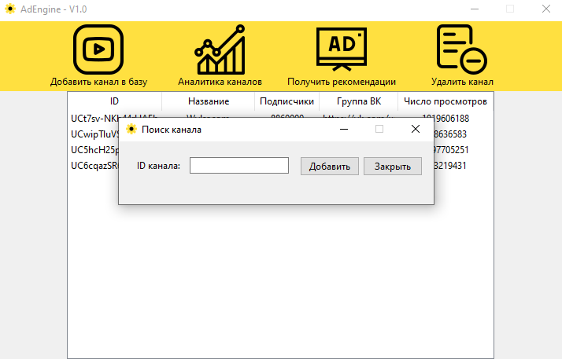

# AdEngine

AdEngine - инструмент, позволяющий получать аналитику каналов и видео на YouTube для размещения наиболее эффективных рекламных размещений.
> Это мой первый проект, опубликованный на GitHub, который являлся темой диплома по дисциплине маркетинг. 
> К сожалению, уделять ему много времени на данный момент я не могу, однако был бы рад услышать предложения по развитию на будущее. 

### Основной функционал

* Загрузка информации о канале по запросу 
* Анализ связанных адресов страниц в социальных сетях
* Анализ последних 20-ти видео, опубликованных на канале для:
    1. Оценка статистических показателей контента
    2. Расчет ER (*engagement rate*) - индекса вовлеченности аудитории
    3. Парсинг комментариев и оценка их по тональной направленности
* Парсинг аудитории через смежные группы в "Вконтакте":
    1. Сбор данных аккаунтов подписчиков группы блоггера во "Вконтакте", согласно необходимому объему выборки
    2. Предоставление усредненных показателей (*срезов*) аудитории (соц.-дем. параметры, находящиеся в свободном доступе)
    3. Сегментация аудитории встроенным средством кластерного анализа, для выявления кластеров ЦА (*целевой аудитории*) на канале блоггера
    4. Сравнение структур аудиторий нескольких разных каналов 

### Заметки
> При возникновении проблем с установкой TensorFlow, инструкция [здесь](https://www.youtube.com/watch?v=MpUvdLD932c)
* [Написание нейросетей кластерного анализа на Python](https://www.youtube.com/channel/UC5gufuYHPSsJA-jul-iwyXA)
* [Датасет русскоязычных твитов, размеченный по тональности](https://study.mokoron.com/)
